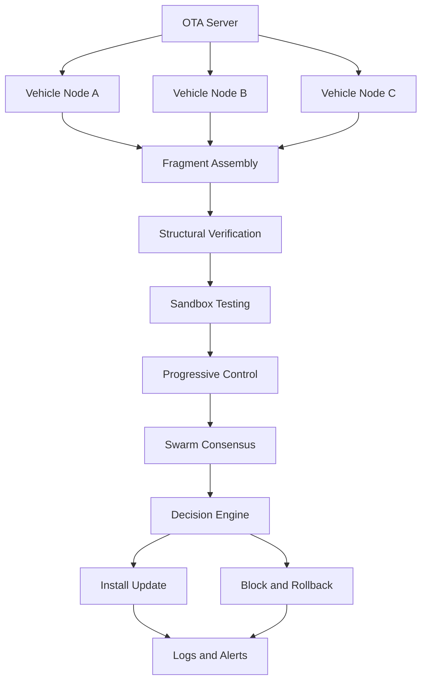

# chimeric-swarm-ota
Chimeric Swarm Attestation for Secure OTA Updates A Zero-Trust, Behavior-Aware Distributed Update Validation Framework

## 🧠 Overview

Modern vehicles receive Over-The-Air (OTA) updates to improve functionality and fix issues. However, current systems rely heavily on digital signatures, which can fail if signing keys are compromised.

Chimeric Swarm OTA introduces a distributed, behavior-aware security model where:
- No single entity is trusted  
- Updates are reconstructed collaboratively  
- Behavior is verified before execution  
- Trust is built progressively  

---

## ⚠️ Problem

- OTA systems are a high-value attack surface  
- Signed updates can still be malicious  
- Centralized trust creates a single point of failure  

---

## 💡 Solution

This project proposes a system that combines:
- Fragmented update distribution  
- Swarm-based validation  
- Sandbox behavior testing  
- Progressive trust control  

---

## 🏗️ System Architecture




🔄 Workflow
Fragmentation
Updates are split into multiple cryptographic fragments
Swarm Distribution
Fragments are distributed across multiple nodes
Assembly and Verification
Nodes reconstruct and validate update integrity
Sandbox Execution
Update is tested in an isolated environment
Progressive Control
Permissions are granted step-by-step
Consensus Decision
Nodes vote: SAFE or SUSPICIOUS
Final Outcome
Install or Block and Rollback
🛡️ Security Features
Zero-trust architecture
No single point of failure
Behavior-based validation
Distributed consensus
Automatic rollback
⚠️ Attack Scenario

Malicious but signed update:

Update passes signature verification
Contains hidden malicious logic

Traditional systems:

Install update → Attack succeeds

Proposed system:

Detects abnormal behavior
Fails consensus
Blocks update


🖥️ Example Output (Simulated)

```
[INFO] Update received
[INFO] Signature verified
[INFO] Running sandbox test
[ALERT] Abnormal behavior detected
[CONSENSUS] Majority suspicious
[DECISION] Update BLOCKED
[ROLLBACK] Reverting to stable version
```